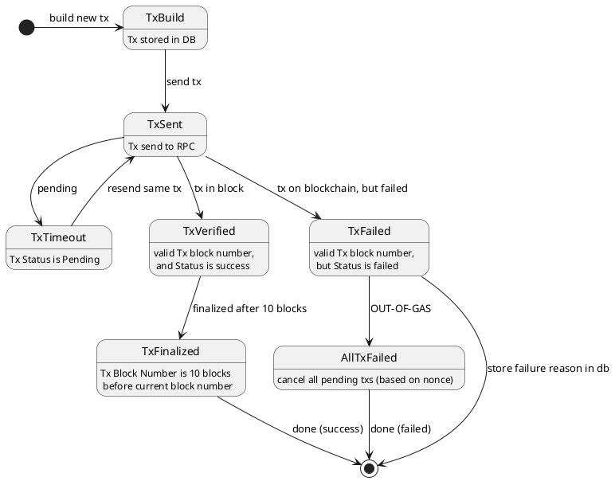

## Tx State

## Processors

**每个交易的定义**
Tx:
* id : id from excel
* chain : eth/ont/neo
* token-type : eth/usdt/ont/ong/oep/neo/gas
* fee-type : eth/ong/gas
* from-addr : local wallet for the task
* to-addr : from excel
* amount : from excel
* nonce : (optional)
* fee : estimated
* txhash : 
* tx : 
* tx-sent-time : when is tx sent to rpc
* tx-block-height : which block is tx in
* (**optional**)tx-rebuild-count : how many times has tx been rebuild?
* tx-result : 
* tx-status : (ready / sent / success / finalized / tx-failed / task-failed)

**数据库表**
Tables
* TaskTable : indexed by id (from excel)
* TaskTxTable : indexed by txhash

**并发处理的通信channels**
* buildtx-req-channel
* buildtx-channel
* sendtx-req-channel
* sendtx-rsp-channel
* verifytx-req-channel
* verifytx-channel
* txdone-channel
* taskdone-channel

**流程**

分为4个routine，完成交易构造到交易确认
* TxBuilder : 加载Excel，构造交易（如果交易失败，重新构造交易）
* TxSender ：发送交易，（如果发送失败，重新发送）
* TxVerifier ：验证交易上链及执行结果
  * 如果超时未上链，重新发送
  * 如果交易失败，重新构造交易
* TaskVerifier ：验证所有交易都是成功/失败状态

#### TxBuilder

1. if table exist:
   1. load from database
2. else:
   1. load from excel
   2. add all to database
3. query nonce from blockchain
4. while true:
   1. wait on buildtx-req-channel
      1. parse buildtx-req
      2. build new tx
      3. update database
      4. update nonce
      5. tx -> sendtx-req-channel
   2. wait on taskdone-channel
      1. quit

#### TxSender

1. send nil-req in buildtx-req-channel
2. while true:
   1. wait on sendtx-req-channel
      1. if tx not in sent-buffer
         1. add sendtx-req to buffer
      2. if buffer not full
         1. send nil-req to buildtx-req-channel
      3. get tx from sendtx-req
      4. tx.tx-send-time = now()
      5. send tx via rpc
      6. update database
      7. send verifytx-req to verifytx-req-channel
      8. if timer not active:
         1. start timer
   2. wait on sendtx-rsp-channel
      1. if sendtx-rsp == success:
         1. remove tx from buffer
         2. if buffer not full
            1. send nil-req to buildtx-req-channel
      2. else if sendtx-rsp == out-of-time:
         1. send tx via rpc
         2. tx.tx-send-time = now()
         3. update database
         4. send verify-tx-req to verifytx-req-channel
   3. wait on taskdone-channel
      1. quit

#### TxVerifier

1. while true:
   1. wait on verifytx-req-channel:
      1. if tx is not in verify-buffer:
         1. add verifytx-req to buffer
      2. if not active timer:
         1. start next active timer
      3. add verifytx to next timer
   2. wait on timer:
      1. for all verify-tx in next-timer
         1. verify status by rpc
         2. if status if success:
            1. send verify-ok to sendtx-rsp-channel
            2. update tx status to success
            3. update tx.blocknum
            4. update database
            5. send tx-done to txdone-channel
         3. else if status is out-of-gas:
            1. close taskdone-channel (all tasks failed)
         4. (**optional**)else if status is failed:
            1. remove tx from verify-buffer
            2. tx.tx-rebuild-count += 1
            3. update database
            4. if tx.tx-rebuild-count > 3
               1. update tx status to failed
               2. send tx-done to txdone-channel
            5. else
               1. send buildtx-req to buildtx-req-channel
         5. else if status if pending:
            1. remove tx from verify-buffer
            2. send verify-out-of-time to sendtx-rsp-channel
   3. wait on taskdone-channel:
      1. quit

#### TaskVerifier

1. alldone = false
2. get all transfer-id
3. while true:
   1. wait on txdone-channel:
      1. get transfer-id from tx
      2. set transfer-id as done
      3. if all transfer-id done: (success or failed)
         1. alldone = true
         2. break
   2. wait on taskdone-channel:
      1. quit
4. if all-done:
   1. get max-block-height of tx.tx-block-height
   2. wait until blockheight > max-block-height + 10
   3. close(taskdone-channel)

