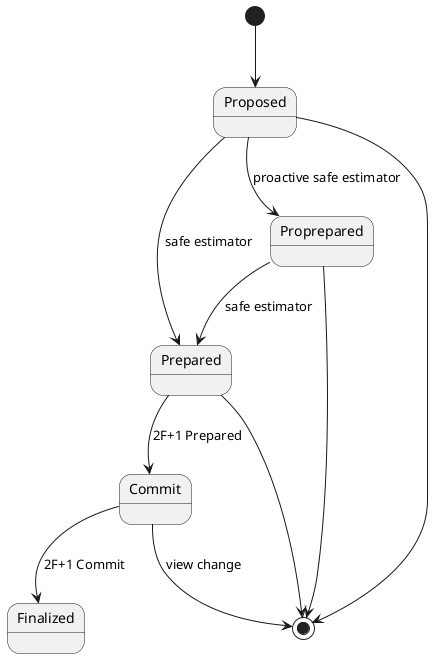

# BFT + PoA Consensus

采用PoA做治理，基于BFT算法实现共识。


### Governance

PoA通过智能合约管理节点准入，任何人可以申请节点加入，经过当前2/3节点同意后，即可加入网络。节点变化在1+ epoch后生效。

### Sys Params

* N：当前网络节点数
* F：网络容错，F = (N-1)/3
* K：pending finalize的最多区块数目
* D：一个epoch的最多区块数，D >> K
* n：proactive节点数
* f：proactive容错，f=(n-1)/3
* `{PK_i}`：智能合约中节点列表

### Command Types

* ViewChange：在某个区块高度，启动新的view
* Proposal：在某个区块高度，在某个block fork，发送block proposal
* Prepare：
  * Prepare(leader, Nil), Prepare for new leader
  * Prepare(leader, Proposal), 经过safe判断后，Prepare for proposal
* Commit：节点验证2F+1完成Prepare后，决定commit

### Proposal States

* Proposed
* ProPrepared
* Prepared
* Commit
* Finalized



### Procedure

pipelined design

新的区块高度H开始共识:
1. 高度H，Leader发起Proposal（最高优先级leader不需要view change）
2. 高度H，Proactive节点判断safe-fork，参与Prepare
3. 收集到2f+1 Prepare后，当前区块Proprepared
   * 高度H，Proposal确定
4. 高度H，其他节点收到2f+1 preprepared后，参与Prepare
4. 高度H+1，Leader可以开始proposal
   * proposal中携带2f+1之前proposal的 preprepared作为justify
5. 高度H+1，Proactive节点判断safe-fork，参与Prepare
   * 高度H+1的Proprepare消息，同时是高度H的Proprepare
6. 高度H，收集到2F+1 Prepare后，当前区块Prepared，Locked, 所有节点开始Commit
7. 高度H-1，收集到2F+1 Commit后，当前区块Finalized

### Msg Definitions

```
Vote = [ RoundVote ]

RoundVote = < NodeID, Height, View, ViewJustify, Proposal, Prepare, Commit, Result >

ViewJustfiy = [ 2F+1 当前View的viewchange签名 ]

Proposal = < Height, BlkHash, ProposalJustify, Blk, msgID >
ProposalJustify = [ 2f+1 前一个区块的proactive prepare签名 ] | [ 2F+1 前一个区块的prepare签名 ]
Blk = < BlkHdr, [txn] >
BlkHdr = < PrevBlkHash, Timestamp, BlockRoot, TxnRoot, ConsensusPayload, LeaderSign >

Prepare = < Height, ProposerID, BlkHash, PrepareJustify, prepareSig, msgID >
PrepareJustify = [ nil ] | [ 2f+1 proactive prepare签名 ]

Commit = < Height, ProposerID, BlkHash, CommitJustify, commitSig, msgID >
CommitJustify = [ 2F+1 prepare签名 ]

Result = < Height, ProposerID, BlkHash, ResultHash, resultHashSig, msgID >

ViewChange = [ NodeID, Height, NewView, Commit, viewSig ]

```

### Safety

任何commit消息都携带 2F+1 Prepare Quorum justify，保证commit proposal是valid proposal，经过了 2F+1 Quorum节点验证为safe fork。

任何decision都携带 2F+1 Commit Quorum justify，保证节点make decision时，2F+1 节点 lock commit到相同的proposal。通过broadcasting保证，2F+1节点完成同一个proposal的decision。

### Complexity Analysis

网络基于广播的通信方式，每个区块的共识需要每个节点参与prepare和commit两个阶段，即每个节点需要对2N节点发送消息，整体网络对每个区块的消息复杂度为 `O(N^2)`

* 放弃基于广播的通信方式，通过leader聚合/转发所有消息的策略，可以实现 `O(N)`
* preactor的引入，只是减少共识latency，没有改善算法复杂度。
* pipeline的引入，可以有效减少出块间隔时间
  * 每个区块高度只有 proactor参与，完成proprepare的共识
    * 如果proprepare共识采用leader管理，复杂度 `O(n)`
  * 所有prepare/commit消息通过 附带在对应proprepare消息中，完成在网络广播，不增加复杂度
  * 如果采用pipeline和leader relay的机制，pending finalize的数目将大于 N/n


### Dynamic validator set

一个epoch的区块数为D，节点加入网络和退出网络所经历的状态变化为：

- nil
- Applied
- Approved
- Active
- Leaving

```plantuml
[*] --> Applied : apply in PoA-Mgmt contract
Applied --> Approved : approved by current authorities
Approved --> Active : After 1+ Epoch
Active --> Leaving : request for leaving
Approved --> Leaving: request for leaving
Leaving --> [*] : After 1+ Epoch

Applied -> [*] : quit or disapproved
```


### Peer Selection

##### Leader的选择
前一个区块的VRF Hash，定义后一个区块的节点顺序列表。
节点顺序中，第一个节点为最高优先级节点，缺省的Leader节点。
顺序F个节点都是候选Leader节点，通过ViewChange启动。

##### Proactive节点的选择
区块高度H，通过shuffle，选择n个节点，主动参与Prepare。
proactive节点优先选择 高度H-1中没有成为proactive节点

>**Prepare和Precommit的区别:**
Prepare确保Quorum节点认同当前fork为safe-fork。
Precommit确保Quorum节点知道了Quorum节点认同了当前fork为safe-fork。
所以在所有消息都是广播的情况下，两者可以统一。

>**Prepare之后为什么需要Commit**
Prepare只是节点认同当前fork为safe-fork，但是如果没有其他限制条件，可能有多个safe-fork。所以Prepare的节点不会锁定到固定的safe-fork上，即具体选定哪条safe-fork尚没有达成共识。
Commit是节点在收到大多数节点认同此safe-fork后，将节点锁定到此safe-fork，因此在2F+1节点在同一个safe-fork到达commit状态后，此safe-fork完成共识。
核心区别为：节点的Commit消息表示节点对safe-fork的锁定，锁定后将拒绝当前view的其他commit，只有view change可以撤销节点对safe-fork的锁定。


