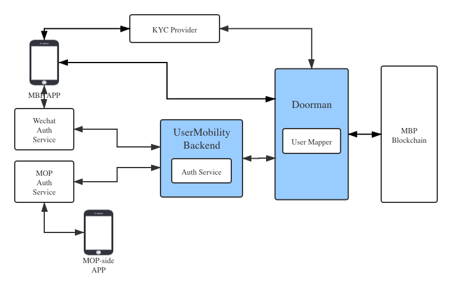

# MBP

MBP as one blockchain-based unified account system.

## Components



## Stories

* User Registration
* User Login with Wechat
* MOP User Login through MBP

### User Registration with KYC

```plantuml
autonumber
entity UserMobilityApp
entity KYCProvider
entity Doorman
entity MBP

activate UserMobilityApp
UserMobilityApp->UserMobilityApp: Register, generate wallet
group KYC
    UserMobilityApp->KYCProvider: Provides (pubkey, driver license), request claim
    activate KYCProvider
    KYCProvider->KYCProvider: Verify driver license
    KYCProvider-->UserMobilityApp: Verify OK
    KYCProvider->Doorman: Register (pubkey, claim)
    deactivate KYCProvider
end
activate Doorman
Doorman->Doorman: Process register request
Doorman->MBP: Register DID(pubkey)
MBP-->Doorman: Transaction notification (DID)
Doorman-->UserMobilityApp: DID received
deactivate Doorman
UserMobilityApp->Doorman: Request claim
Doorman-->UserMobilityApp: Return claim
UserMobilityApp->UserMobilityApp: Store claim in app
```

### User Login with Wechat

1. User login UserMobilityApp with Wechat (callback url redirected to Doorman)
3. Wechat authentication server callbacks Doorman
4. Doorman request `access-token` from Wechat authentication server
5. Doorman make user mapping
6. Doorman registers DID in MBP
7. Doorman notifies App user login OK

```plantuml
autonumber
actor UserMobilityApp
entity WechatBackend
entity Doorman
database MBP

UserMobilityApp->Doorman: Open
Doorman->UserMobilityApp: Login by Wechat supported
UserMobilityApp->WechatBackend: Login by Wechat
WechatBackend->Doorman: Callback with login code, claim scope
Doorman->UserMobilityApp: Request user confirmation of scope
UserMobilityApp->Doorman: Confirm 
activate Doorman
Doorman->WechatBackend: Request AccessToken(clientID, secret)
activate WechatBackend
WechatBackend-->Doorman: Return AccessToken
deactivate WechatBackend
note left: AccessToken from Wechat,\n also in JWT format
Doorman->Doorman: Create wallet
Doorman->MBP: DID-register(pubkey)
MBP-->Doorman: Transaction notification
Doorman->Doorman: Update UserMapping
Doorman->WechatBackend: Request Wechat user profile \n(with AccessToken)
note left: user profile includes \nnickname, head photo ...
WechatBackend-->Doorman: return user profile
Doorman-->UserMobilityApp: Login OK
deactivate Doorman
```

### MOP Login through MBP Signin

1. User login MOP through MBP-Signin
2. MOP request authentication from Doorman
3. Doorman verifies user request, callback MOP
4. MOP get login code, request AccessToken
5. Doorman grant AccessToken(jwt) to MOP
6. MOP request user information with AccessToken
7. MOP notify User login OK

```plantuml
autonumber
entity User
entity MOP
entity UserMobilityApp
entity UserMobilityBackend
entity Doorman

User->MOP: Open
MOP->User: Login through MBP-Signin supported
User->MOP: Click `MBP SignIn`
group Assume User KYCed in MBP
    MOP->UserMobilityApp: SignIn
    UserMobilityApp->Doorman: Request logincode
    activate Doorman
    Doorman->MBP: Verify login claim
    MBP-->Doorman: Login OK
    Doorman-->MOP: Callback with logincode and claim scope
end
deactivate Doorman
MOP->User: Request confirmation of scope
User->MOP: Confirm
activate MOP
MOP->UserMobilityBackend: Request AccessToken
activate UserMobilityBackend
UserMobilityBackend-->MOP: Return AccessToken
note right: AccessToken is in JWT
deactivate UserMobilityBackend
MOP->MOP: Save user access token
MOP->UserMobilityBackend: Request user info
note left: Request user nickname,\n head photo, profile, etc
activate UserMobilityBackend
UserMobilityBackend->UserMobilityBackend: Validate scope of request
UserMobilityBackend-->MOP: Return user info
deactivate UserMobilityBackend
MOP-->User: Login OK
deactivate MOP
```
